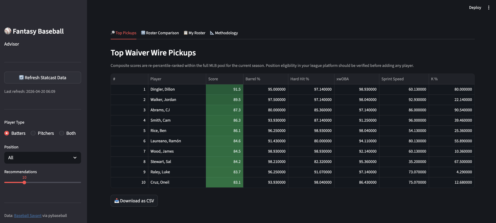

# ⚾ Fantasy Baseball Advisor

See a deployed version of this applcation here: https://mjfrigaard-fantasy-baseball-advisor.share.connect.posit.cloud/

A Streamlit web app and CLI for data-driven fantasy baseball decisions. Pulls
real Statcast data via [pybaseball](https://github.com/jldbc/pybaseball),
scores players with a weighted composite metric, and surfaces waiver-wire
recommendations and roster swap suggestions.

---

## Screenshot




---

## Setup

**Requirements:** Python 3.11+

1. Clone the repo and enter the project directory:

```bash
git clone <repo-url>
cd fantasy-baseball-advisor
```

2. Create and activate a virtual environment:

```bash
python3 -m venv .venv
source .venv/bin/activate
```

3. Install dependencies:

```bash
pip install -r requirements.txt
```

4. Copy the example env file:

```bash
cp config/.env.example .env
```

---

## Running the Web App

From the project root with the venv active:

```bash
source .venv/bin/activate
streamlit run src/app.py
```

Or without activating, using the venv binary directly:

```bash
.venv/bin/streamlit run src/app.py
```

> **Note** — if you have a system-wide or conda `streamlit` on your `$PATH`, running
> `streamlit run` without activating the venv will use the wrong Python environment
> and fail to find project dependencies.

The app opens at `http://localhost:8501`. Use the **Refresh Statcast Data**
button in the sidebar to fetch the latest stats on first launch.

---

## CLI Usage

```bash
python -m fantasy_baseball_advisor --help
```

---

## Project Structure

```
fantasy-baseball-advisor/
├── src/
│   ├── app.py                          # Streamlit web app
│   ├── recommender.py                  # Orchestration layer
│   ├── analysis/
│   │   └── metrics.py                  # PlayerScorer (composite scoring)
│   ├── data/
│   │   └── statcast_client.py          # Statcast fetch + parquet cache
│   ├── roster/
│   │   └── manager.py                  # RosterManager (YAML-backed)
│   └── fantasy_baseball_advisor/
│       └── cli.py                      # Click CLI entry point
├── tests/
│   ├── test_metrics.py
│   └── test_recommender.py
├── data/
│   └── cache/                          # Parquet cache (gitignored)
├── config/
│   ├── my_roster.yaml                  # Your fantasy roster
│   ├── unavailable_players.yaml        # Other teams' rosters
│   └── .env.example
├── pyproject.toml
└── requirements.txt
```

---

## Configuration

### `config/my_roster.yaml`

Declare your current fantasy roster. Player names must match pybaseball's
`"Last, First"` format (the same format shown on Baseball Savant).

```yaml
batters:
  - name: "Freeman, Freddie"
    player_id: 664034
    positions: [1B]

pitchers:
  - name: "Burnes, Corbin"
    player_id: 669203
    positions: [SP]
```

### `config/unavailable_players.yaml`

List every player already claimed by another team in your league.

```yaml
unavailable:
  - name: "Judge, Aaron"
    player_id: 592450
```

MLBAM `player_id` values can be found in Baseball Savant URLs or via
`pybaseball.playerid_lookup("last", "first")`.

---

## Scoring Model

Composite scores use Baseball Savant percentile ranks (1–100, higher = better)
re-ranked within the displayed player pool.

| Batter Metric | Weight |
|---|---|
| Barrel Rate | 30 % |
| Hard-Hit Rate (95+ mph) | 25 % |
| Expected wOBA (xwOBA) | 25 % |
| Sprint Speed | 10 % |
| Strikeout Rate (inverted) | 10 % |

| Pitcher Metric | Weight |
|---|---|
| Expected ERA / xERA (inverted) | 30 % |
| Whiff Rate | 25 % |
| Barrel Rate Allowed (inverted) | 20 % |
| Chase Rate | 15 % |
| Hard-Hit Rate Allowed (inverted) | 10 % |

---

## Running Tests

```bash
python -m pytest tests/ -v
```
